# Brain-Doctor Hospital V4 — Mermaid Diagram Suite

> **Visual Architecture Reference**  
> **Version:** 4.0  
> **Last Updated:** 2026-01-28

This document contains comprehensive Mermaid diagrams illustrating the Brain-Doctor Hospital V4 architecture, data flows, and operational patterns.

---

## Table of Contents

1. [System Architecture](#1-system-architecture)
2. [Worker Pipeline Flow](#2-worker-pipeline-flow)
3. [Healdec Recovery Flow](#3-healdec-recovery-flow)
4. [Data Flow Diagrams](#4-data-flow-diagrams)
5. [UI Component Hierarchy](#5-ui-component-hierarchy)
6. [Database Schema ERD](#6-database-schema-erd)
7. [Deployment Topology](#7-deployment-topology)
8. [Job State Machine](#8-job-state-machine)
9. [Identity Merge Flow](#9-identity-merge-flow)

---

## 1. System Architecture

### High-Level Component Diagram

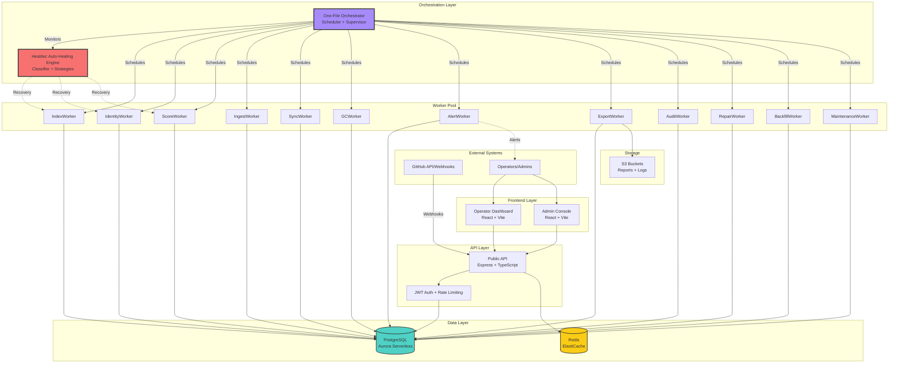

---

## 2. Worker Pipeline Flow

### Complete Worker Dependency Graph

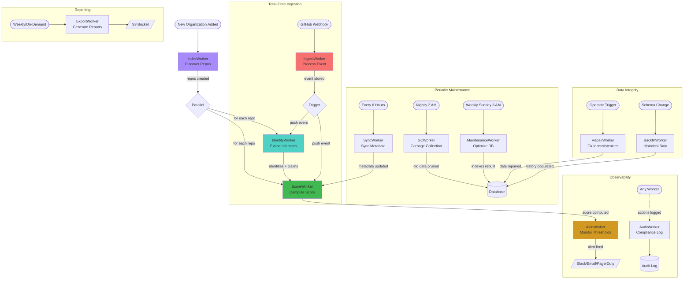

### Individual Worker Input/Output

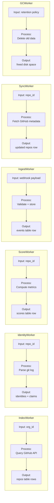

---

## 3. Healdec Recovery Flow

### Failure Classification Decision Tree

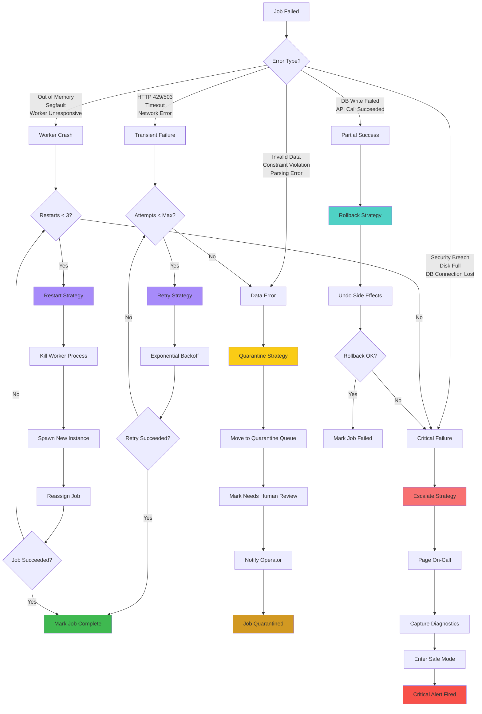

### Recovery Strategy Selection Logic

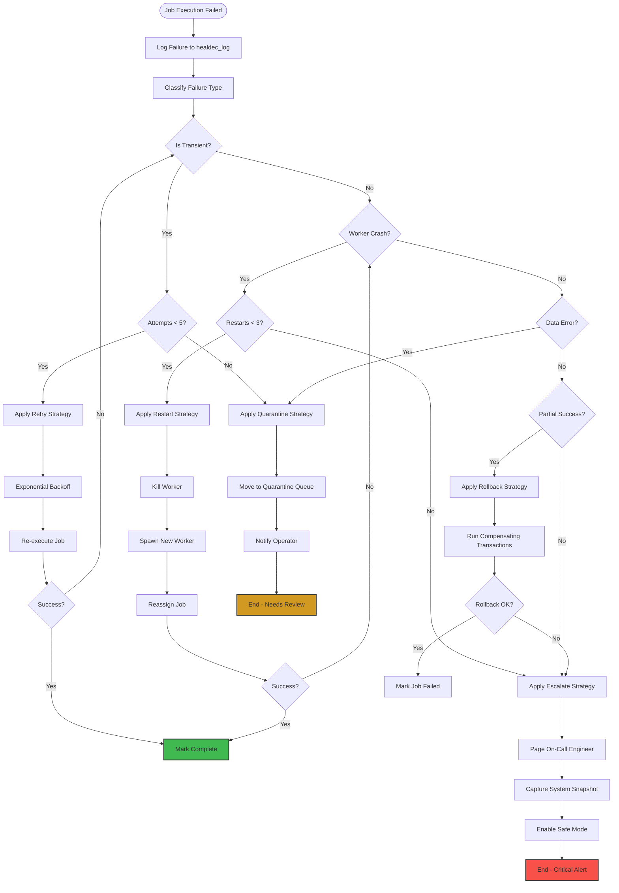

---

## 4. Data Flow Diagrams

### 4.1 Repository Onboarding Sequence

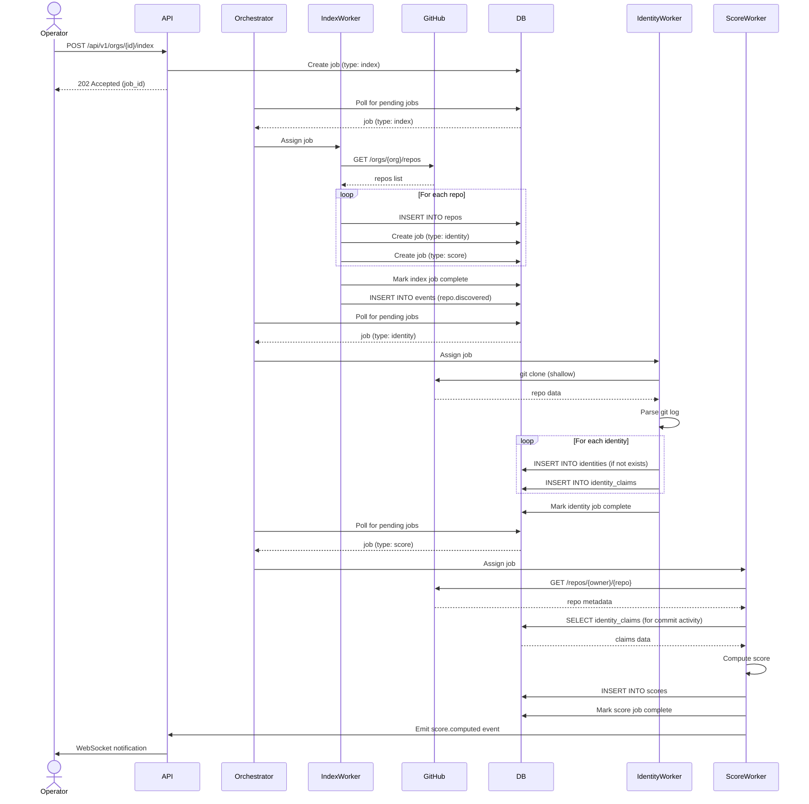

### 4.2 Identity Claim Lifecycle

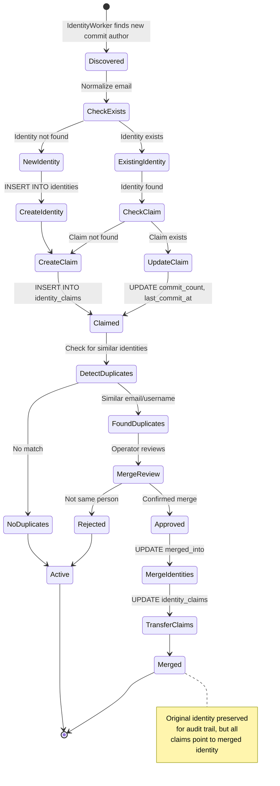

### 4.3 Auto-Healing Lifecycle

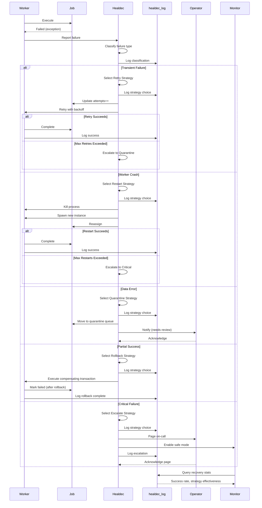

### 4.4 Webhook Ingestion Flow

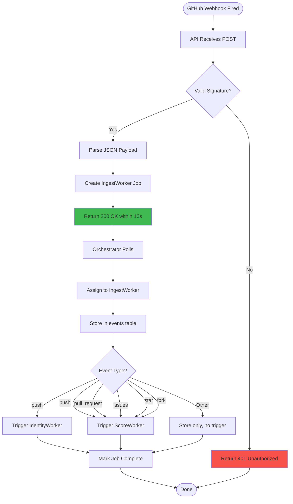

---

## 5. UI Component Hierarchy

### Operator Dashboard Component Tree

```mermaid
graph TD
    App[App.tsx] --> Router[React Router]
    
    Router --> HomePage[HomePage]
    Router --> ReposPage[RepositoriesPage]
    Router --> IdentitiesPage[IdentitiesPage]
    Router --> JobsPage[JobsPage]
    Router --> HealdecPage[HealdecPage]
    Router --> LogsPage[LogsPage]
    
    App --> Layout[Layout Component]
    Layout --> TopNav[TopNav]
    Layout --> LeftPanel[LeftPanel]
    Layout --> CenterPanel[CenterPanel]
    Layout --> RightPanel[RightPanel]
    
    LeftPanel --> RepoSwitcher[RepoSwitcher]
    RepoSwitcher --> RepoCard[RepoCard]
    RepoCard --> HealthBar[HealthBar]
    
    CenterPanel --> HomePage
    CenterPanel --> ReposPage
    CenterPanel --> IdentitiesPage
    CenterPanel --> JobsPage
    CenterPanel --> HealdecPage
    CenterPanel --> LogsPage
    
    HomePage --> VitalsModal[VitalsModal]
    HomePage --> ScanBox[ScanBox]
    HomePage --> ActionButtons[ActionButtons]
    
    ReposPage --> RepoTable[RepoTable]
    RepoTable --> RepoCard
    RepoCard --> OpenVitals[Click] -.-> VitalsModal
    
    IdentitiesPage --> IdentityTable[IdentityTable]
    IdentityTable --> IdentityCard[IdentityCard]
    IdentityCard --> MergeAction[Merge Button] -.-> MergeModal[IdentityMergeModal]
    
    JobsPage --> JobQueue[JobQueue]
    JobQueue --> JobCard[JobCard]
    JobCard --> InspectAction[Inspect] -.-> BlackboxModal[BlackboxModal]
    JobCard --> RetryAction[Retry] -.-> ConfirmModal[ConfirmDialog]
    
    HealdecPage --> HealdecDashboard[HealdecDashboard]
    HealdecDashboard --> StrategyChart[StrategyChart]
    HealdecDashboard --> HealdecControls[HealdecControls]
    HealdecControls --> ImmunizerModal[ImmunizerModal]
    
    LogsPage --> SmartBrainTerminal[SmartBrainTerminal]
    SmartBrainTerminal --> LogFilters[LogFilters]
    SmartBrainTerminal --> LogStream[LogStream]
    
    RightPanel --> HealthStream[HealthStream]
    RightPanel --> RecentEvents[RecentEvents]
    
    VitalsModal --> HealthReportModal[HealthReportModal]
    
    ActionButtons --> TriggerWorkflow[Trigger] -.-> ActionWorkflowModal[ActionWorkflowModal]
    
    style App fill:#A78BFA,stroke:#333,stroke-width:3px
    style VitalsModal fill:#4FD1C5,stroke:#333,stroke-width:2px
    style HealthReportModal fill:#4FD1C5,stroke:#333,stroke-width:2px
    style BlackboxModal fill:#0d1117,stroke:#FACC15,stroke-width:2px
    style ImmunizerModal fill:#F87171,stroke:#333,stroke-width:2px
    style SmartBrainTerminal fill:#21262d,stroke:#3fb950,stroke-width:2px
```

### Modal Relationships & Navigation

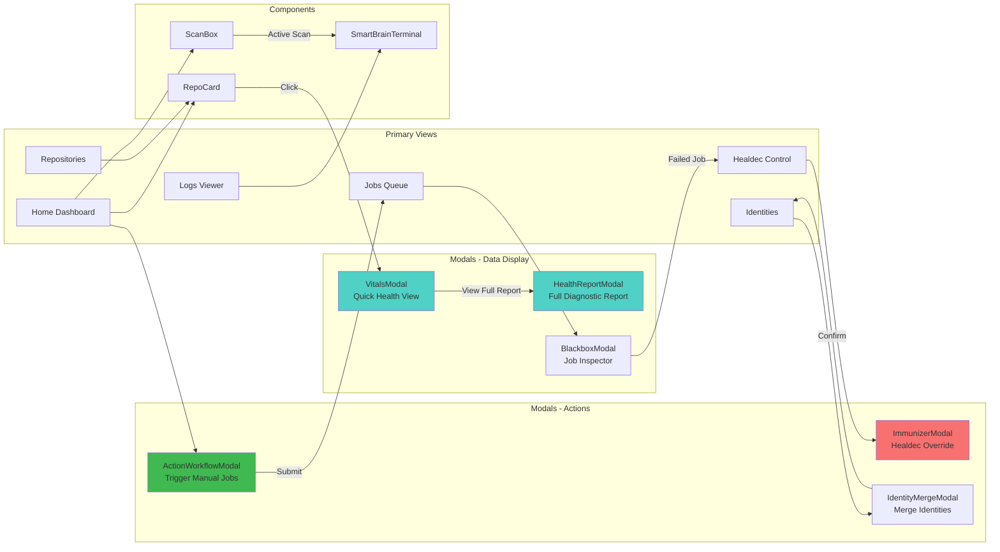

---

## 6. Database Schema ERD

### Complete Schema with Relationships

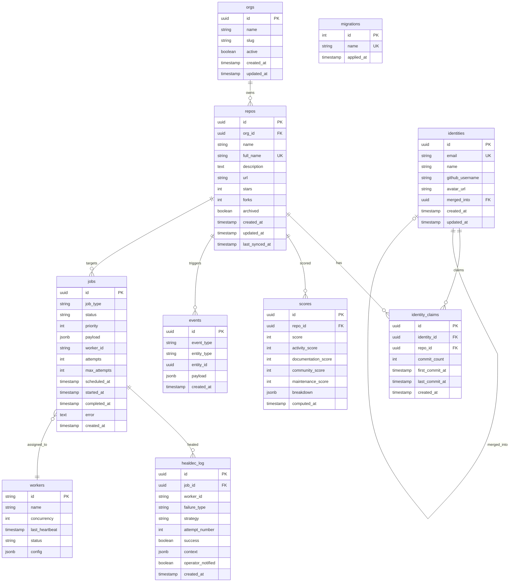

### Table Cardinality Summary

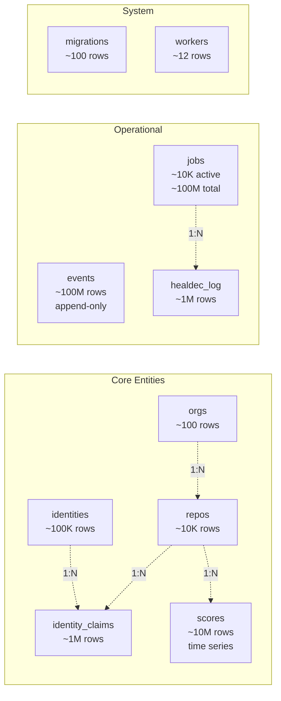

---

## 7. Deployment Topology

### AWS Infrastructure Diagram

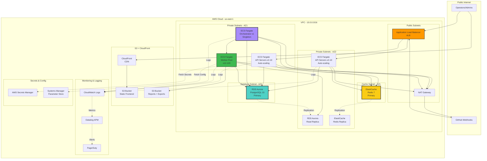

### Scaling Paths

```mermaid
graph TD
    subgraph "Compute Scaling"
        A1[Low Load<br/>2 API servers<br/>12 workers] -->|CPU >70%| A2[Medium Load<br/>5 API servers<br/>36 workers]
        A2 -->|CPU >70%| A3[High Load<br/>10 API servers<br/>120 workers]
        A3 -->|CPU <30%| A2
        A2 -->|CPU <30%| A1
    end
    
    subgraph "Database Scaling"
        B1[Aurora Serverless<br/>0.5 ACU] -->|Connections >80%| B2[1 ACU]
        B2 -->|Queries >1000/s| B3[2 ACU]
        B3 -->|Write load high| B4[Add Read Replica]
        B4 -->|Complex queries| B5[Add Materialized Views]
    end
    
    subgraph "Cache Scaling"
        C1[t4g.medium<br/>1 replica] -->|Memory >80%| C2[t4g.large<br/>1 replica]
        C2 -->|Hit rate <90%| C3[Optimize TTL]
        C2 -->|Read heavy| C4[Add 2nd replica]
    end
    
    style A3 fill:#F87171
    style B5 fill:#4FD1C5
    style C4 fill:#FACC15
```

---

## 8. Job State Machine

### Job Lifecycle States

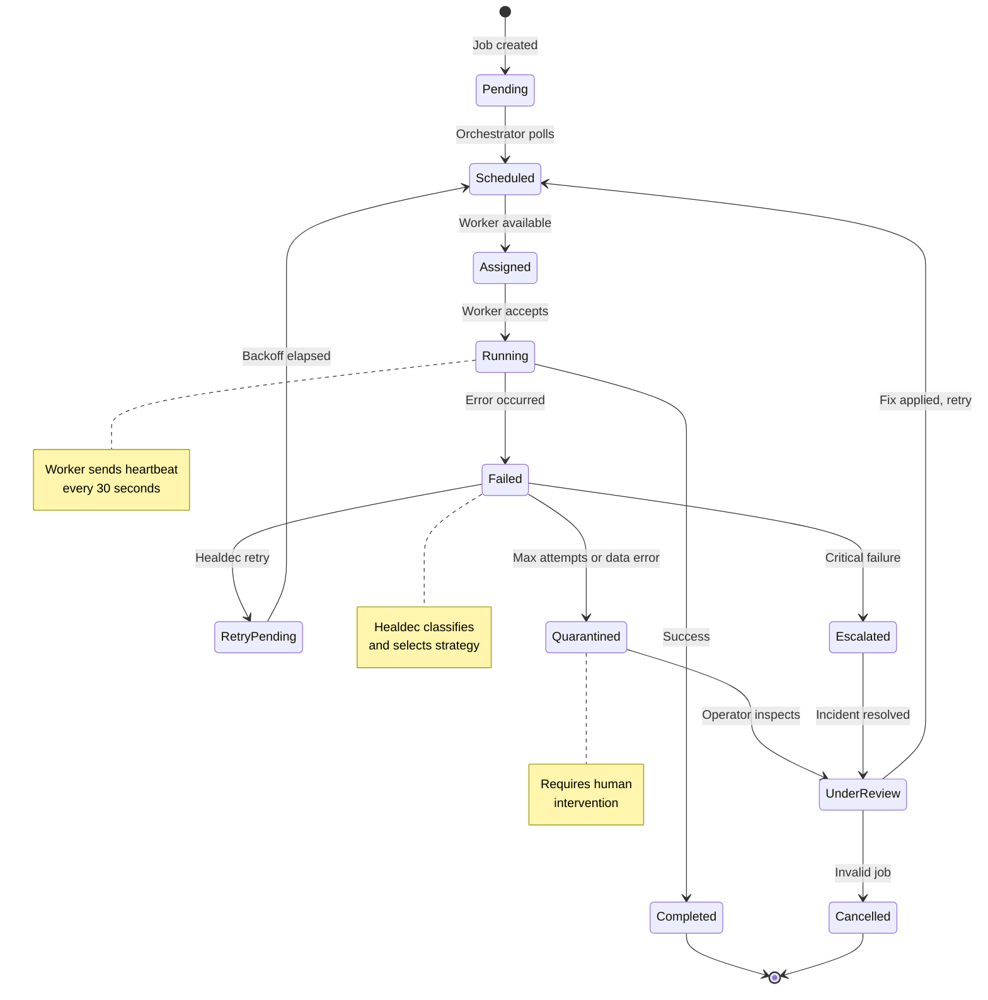

---

## 9. Identity Merge Flow

### Identity Deduplication Process

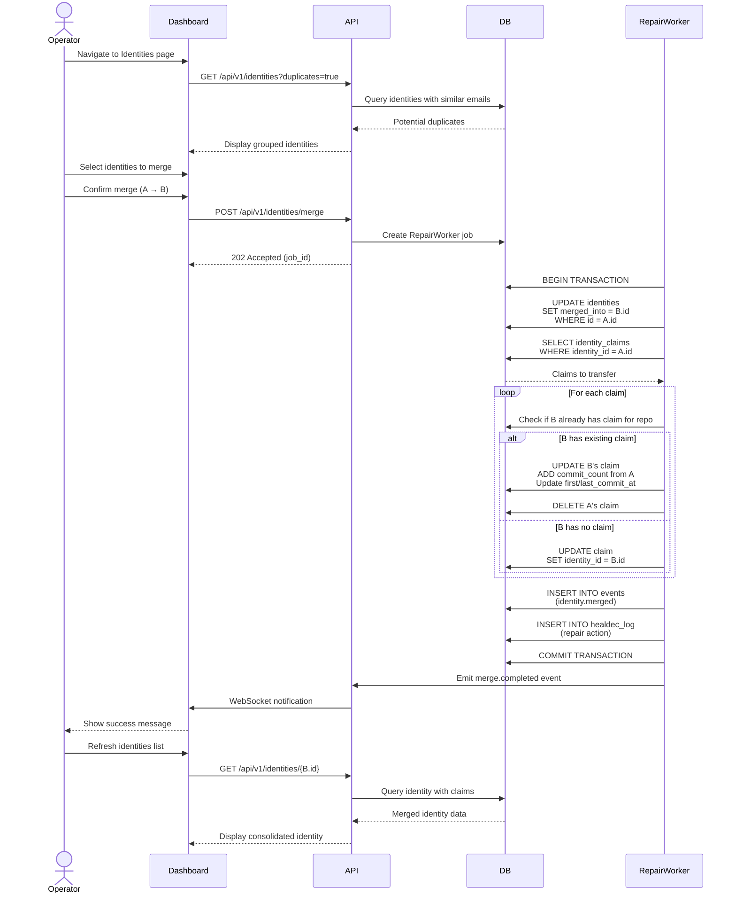

---

## Additional Resources

- [ARCHITECTURE.md](./ARCHITECTURE.md) - Full architecture specification
- [docs/REPOSITORY_STRUCTURE.md](./docs/REPOSITORY_STRUCTURE.md) - Suggested folder layout
- [docs/OPERATOR_HANDBOOK.md](./docs/OPERATOR_HANDBOOK.md) - Deployment and operations guide
- [docs/DOCS_SITE_STRUCTURE.md](./docs/DOCS_SITE_STRUCTURE.md) - Documentation site layout

---

**Last Updated:** 2026-01-28  
**Maintained By:** AlgoBrainDoctor Core Team  
**License:** MIT
